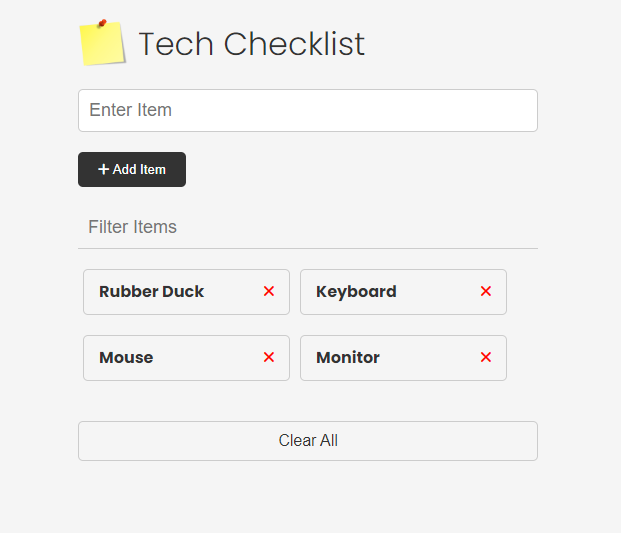

# Tech Checklist

A lightweight web application for managing your tech shopping list. Built with HTML, JavaScript, and DOM manipulation, this app uses Local Storage to persist your checklist items.

Perfect for tech enthusiasts who want to keep track of gadgets and components they plan to buy. Easy to use and requires no backend or database setup.

## Prerequisites

- Text Editor (VS Code)
- Git

## Built with

- HTML
- CSS
- JavaScript

## Installation

1. Clone the repository to your local machine.

```
git@github.com:uttamshr10/tech-checklist.git
```

2. Open live server to view this project.

<p align="center"><b>Home page</b></p>



[Live Demo](https://uttamshr10.github.io/tech-checklist/)

# Author

## Uttam Shrestha

[](https://www.linkedin.com/in/uttamshr/)

[](https://github.com/uttamshr10)

# Contributing

Contributions are welcome! If you find any bugs or have any suggestions for improvements, please create an issue or a pull request.

# Contact

If you have any questions or feedback, feel free to contact me at utam.shrestha65@gmail.com
